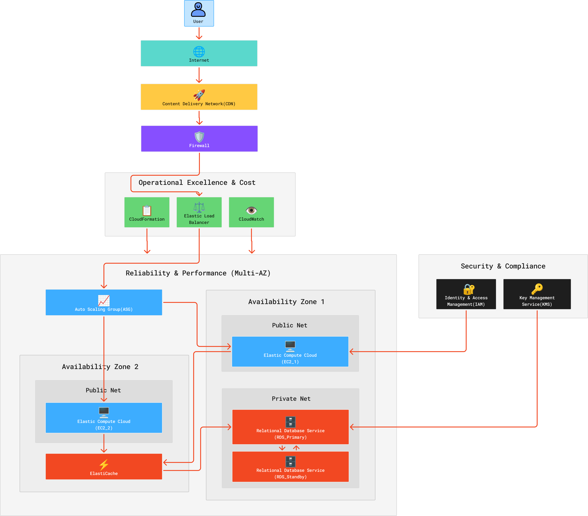

# Techora Solutions Company Portal Migration  

## Executive Summary

This report details the migration strategy for Techora Solutions' two-tier web application from on-premises servers to AWS. By applying the AWS Well-Architected Framework (WAF) and Cloud Adoption Framework (CAF), I ensured a design that is secure, resilient, and optimized for cost and performance from day one.

## Review of Existing Architecture

The web application’s workload currently consists of 2 components.

### Components of the Workload

#### Frontend Tier

A web server hosting the company’s portal interface on a single physical machine, serving HTTP/HTTPS requests to end users.

#### Backend Tier

A relational database server which stores user credentials, portal content and application data, with a direct connection from the frontend.

### Identified Risks and Weaknesses

1. Both the frontend and backend appear to be running on single instances without redundancy.

2. There is no documented automated backup or disaster recovery plan.

3. The on-premises deployment lacks geographic distribution.

4. The system is not scalable, due to the fixed capacity tied to physical hardware.

5. There is a limited visibility into the application’s performance and health.

6. A single web server cannot handle traffic spikes.

  

## AWS Well-Architected Framework Evaluation

Below is an evaluation of the current system’s workload against the 5 pillars of the AWS Well-Architected Framework:

| Pillar | Observation | Improvement Recommendation | Supporting AWS Service |
|--------|-------------|----------------------------|------------------------|
| **Operational Excellence** | **Strength:** Migrating to AWS enables infrastructure-as-code adoption.   **Area for Improvement:** Current manual deployment and configuration management need to be improved. | Implement automated deployment pipelines and infrastructure provisioning using version-controlled templates. | AWS CloudFormation |
| **Security** | **Strength:** Opportunity to implement defense-in-depth from migration start.   **Area for Improvement:** Likely broad network access rules and no encryption at rest. | Implement least-privilege access controls, encrypt data at rest and in transit, enable MFA, use private subnets for database. | AWS IAM, AWS KMS |
| **Reliability** | **Strength:** AWS provides multi-AZ infrastructure foundation.   **Area for Improvement:** Single-instance deployment creates availability risk and no automated failover. | Deploy frontend across multiple Availability Zones with auto-scaling, use Multi-AZ database deployment, implement automated backups. | Amazon EC2 Auto Scaling, Amazon RDS |
| **Performance Efficiency** | **Strength:** Cloud enables right-sizing and performance testing.   **Area for Improvement:** Fixed on-premises capacity cannot adapt to demand variations. | Use managed services to offload undifferentiated work, implement caching layer, select appropriate instance types based on workload profiling. | Amazon ElastiCache, AWS Elastic Beanstalk |
| **Cost Optimization** | **Strength:** Pay-per-use model eliminates overprovisioning.   **Area for Improvement:** Risk of unmonitored resource sprawl and lack of cost visibility. | Implement tagging strategy, use Reserved Instances or Savings Plans for predictable workload, enable cost monitoring and budgets. | AWS Cost Explorer, AWS Budgets, AWS Trusted Advisor |

## Application of AWS Cloud Adoption Framework

### The Business Perspective

#### Current Readiness

Techora Solutions has identified the need to migrate and secure management support, indicating business awareness of cloud benefits. However, the organization needs to establish clear success metrics for the migration beyond technical implementation.

#### Key Actions Needed

To be fully ready for migration, they need to:

· Define measurable business outcomes (e.g., reduced downtime from X% to Y%, cost reduction targets, improved employee portal access times)

· Establish a business case documenting TCO comparison between on-premises and AWS

· Create a migration roadmap with phased milestones tied to business value delivery

· Identify stakeholders across departments who depend on the portal and communicate migration timeline

### The People Perspective

#### Current Readiness

The organization likely has IT staff familiar with traditional infrastructure but may lack AWS-specific skills. The migration requires upskilling existing teams or acquiring cloud expertise.

#### Key Actions Needed

To be fully ready for migration, they need to:

· Conduct skills gap analysis for current IT operations and development teams

· Provide AWS training and certification opportunities (AWS Certified Solutions Architect, SysOps Administrator)

· Define new roles and responsibilities for cloud operations (CloudOps team structure)

· Establish a center of excellence or cloud competency center to share knowledge

· Plan for change management to address resistance and build cloud-first culture

### The Governance Perspective

#### Current Readiness

On-premises governance likely exists but needs adaptation for cloud environment. Policies for resource provisioning, cost control, and compliance must be established before large-scale deployment.

#### Key Actions Needed

To be fully ready for migration, they need to:

· Define cloud governance policies covering resource tagging, naming conventions, and account structure

· Establish a multi-account strategy using AWS Organizations (separate accounts for dev, test, production)

· Implement Service Control Policies (SCPs) to enforce organizational standards

· Create approval workflows for infrastructure changes and cost thresholds

· Define data classification and handling policies for cloud-stored data

### The Platform Perspective

#### Current Readiness

The two-tier architecture is straightforward to migrate, but the platform design must incorporate AWS-native services and best practices rather than simple lift-and-shift.

#### Key Actions Needed

To be fully ready for migration, they need to:

· Design VPC architecture with public and private subnets across multiple Availability Zones

· Select appropriate compute options (EC2 with Auto Scaling vs. containers vs. serverless for frontend)

· Choose managed database service (Amazon RDS) with appropriate engine and Multi-AZ configuration

· Implement CI/CD pipeline for automated testing and deployment

· Establish network connectivity strategy (VPN or AWS Direct Connect if hybrid period needed)

### The Security Perspective

#### Current Readiness

Migration presents opportunity to implement security controls from the start. Current on-premises security posture is unknown but likely has gaps given identified risks.

#### Key Actions Needed

To be fully ready for migration, they need to:

· Implement identity federation or AWS IAM Identity Center for centralized user access

· Enable AWS CloudTrail for audit logging and Amazon GuardDuty for threat detection

· Configure security groups and NACLs following least-privilege principle (database only accessible from frontend tier)

· Enable encryption at rest using AWS KMS for RDS and EBS volumes

· Implement AWS Secrets Manager for database credentials and API keys

· Enable AWS WAF on Application Load Balancer to protect against common web exploits

### The Operations Perspective

#### Current Readiness

Manual operations processes must transition to automated, cloud-native approaches. Monitoring and incident response capabilities need establishment in AWS environment.

#### Key Actions Needed

To be fully ready for migration, they need to:

· Implement centralized logging using Amazon CloudWatch Logs with log retention policies

· Configure CloudWatch alarms for critical metrics (CPU, memory, database connections, application errors)

· Set up AWS Systems Manager for patch management and operational tasks

· Establish runbooks for common operational scenarios using AWS Systems Manager Automation

· Define backup and recovery procedures using AWS Backup with tested restore processes

· Implement infrastructure-as-code for all resources to enable repeatable deployments

## Improved Architecture Design

This architecture implements a high-availability, multi-tier environment to resolve the manual deployment and single-instance reliability risks identified in the evaluation of Techora Solutions’ company portal. By leveraging AWS CloudFormation for Infrastructure-as-Code and Amazon EC2 Auto Scaling across multiple Availability Zones, the system eliminates single points of failure while ensuring operational consistency. Security is reinforced through AWS IAM least-privilege access and AWS KMS encryption, while the data tier is optimized for resilience using Multi-AZ Amazon RDS and Amazon ElastiCache. Finally, integrated monitoring via CloudWatch and AWS Budgets provides the visibility required to maintain cost efficiency and prevent resource sprawl.

## Reflection

This lab demonstrated how AWS frameworks provide structured approaches to cloud architecture decisions. The Well-Architected Framework's five pillars forced systematic evaluation of the workload across operational, security, reliability, performance, and cost dimensions, revealing gaps that might otherwise be overlooked in a simple lift-and-shift migration. The Cloud Adoption Framework highlighted that successful migration requires more than technical design, where organizational readiness across business alignment, people skills, governance policies, and operational processes determines long-term success.

The most valuable insight was recognizing that AWS-native services (managed databases, load balancers, auto-scaling) eliminate undifferentiated work and inherently improve architecture across multiple pillars simultaneously. For example, choosing RDS Multi-AZ addresses reliability through automatic failover, security through managed patching, and operational excellence through automated backups—demonstrating how service selection compounds benefits. The frameworks provide a shared vocabulary for communicating architectural decisions to both technical and business stake holders.